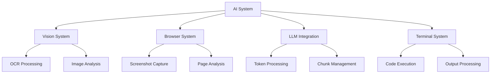
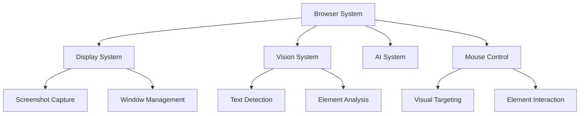
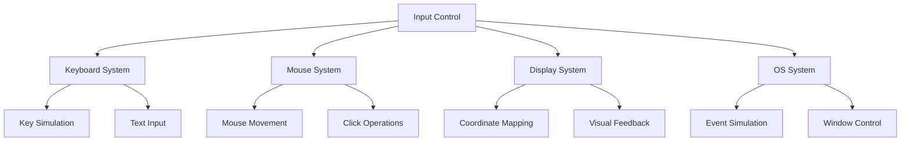
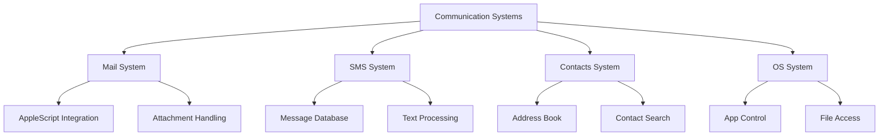

# Component Dependency Analysis

## Core Component Map

### 1. AI System Dependencies


### 2. Browser System Dependencies


### 3. Input Control Dependencies


### 4. Communication Systems Dependencies


## Direct Dependencies

### AI System
- **Required Components:**
  - Vision System (image analysis)
  - Browser System (web content)
  - Terminal System (code execution)
  - LLM Integration (language processing)

- **Optional Components:**
  - Display System (visual feedback)
  - File System (data storage)

### Browser System
- **Required Components:**
  - Display System (screenshots)
  - Vision System (element detection)
  - Mouse System (interaction)
  - AI System (content analysis)

- **Optional Components:**
  - Keyboard System (input)
  - File System (downloads)

### Input Control System
- **Required Components:**
  - OS System (event simulation)
  - Display System (coordinates)
  - Mouse System (movement)
  - Keyboard System (input)

- **Optional Components:**
  - Vision System (targeting)
  - Browser System (web interaction)

### Communication System
- **Required Components:**
  - OS System (app control)
  - Contacts System (addressing)
  - File System (attachments)

- **Optional Components:**
  - Browser System (web mail)
  - Display System (visual feedback)

## Resource Dependencies

### File System Resources
```python
# Shared file access patterns
class ResourceManager:
    def __init__(self):
        self.active_resources = {}
        self.locks = {}

    def acquire(self, resource_id):
        if resource_id not in self.locks:
            self.locks[resource_id] = threading.Lock()
        self.locks[resource_id].acquire()
        
    def release(self, resource_id):
        if resource_id in self.locks:
            self.locks[resource_id].release()
```

### Process Resources
```python
# Process management patterns
class ProcessManager:
    def __init__(self):
        self.active_processes = {}
        
    def start_process(self, cmd):
        process = subprocess.Popen(
            cmd,
            stdin=subprocess.PIPE,
            stdout=subprocess.PIPE,
            stderr=subprocess.PIPE
        )
        return process
        
    def terminate_process(self, process_id):
        if process_id in self.active_processes:
            self.active_processes[process_id].terminate()
```

### Memory Resources
```python
# Memory management patterns
class MemoryManager:
    def __init__(self):
        self.cached_resources = {}
        self.max_cache_size = 1000
        
    def cache(self, key, value):
        if len(self.cached_resources) > self.max_cache_size:
            self.cached_resources.pop(next(iter(self.cached_resources)))
        self.cached_resources[key] = value
```

## State Dependencies

### Component State
```python
# State management patterns
class StateManager:
    def __init__(self):
        self.states = {}
        
    def save_state(self, component_id, state):
        self.states[component_id] = state
        
    def restore_state(self, component_id):
        return self.states.get(component_id)
```

### Shared State
```python
# Shared state patterns
class SharedState:
    def __init__(self):
        self._state = {}
        self._lock = threading.Lock()
        
    def update(self, key, value):
        with self._lock:
            self._state[key] = value
            
    def get(self, key):
        with self._lock:
            return self._state.get(key)
```

## Critical Paths

### 1. Code Execution Path
```
Terminal -> Language Implementation -> Process Management -> Output Processing -> Display
```

### 2. Web Interaction Path
```
Browser -> Display -> Vision -> AI -> Mouse/Keyboard -> OS
```

### 3. Communication Path
```
Mail/SMS -> OS -> Contacts -> File System -> Display
```

### 4. Vision Processing Path
```
Vision -> AI -> Display -> Mouse -> Browser
```

## Improvement Opportunities

### 1. Resource Management
- Implement centralized resource manager
- Add resource pooling
- Improve cleanup mechanisms

### 2. State Management
- Add state persistence
- Improve state synchronization
- Enhance error recovery

### 3. Dependency Optimization
- Reduce circular dependencies
- Implement lazy loading
- Add dependency injection

## Next Steps

1. **Detailed Analysis**
   - Map indirect dependencies
   - Document circular dependencies
   - Identify optimization points

2. **Resource Analysis**
   - Track resource usage
   - Identify bottlenecks
   - Document sharing patterns

3. **State Analysis**
   - Map state flow
   - Document state dependencies
   - Identify synchronization issues
