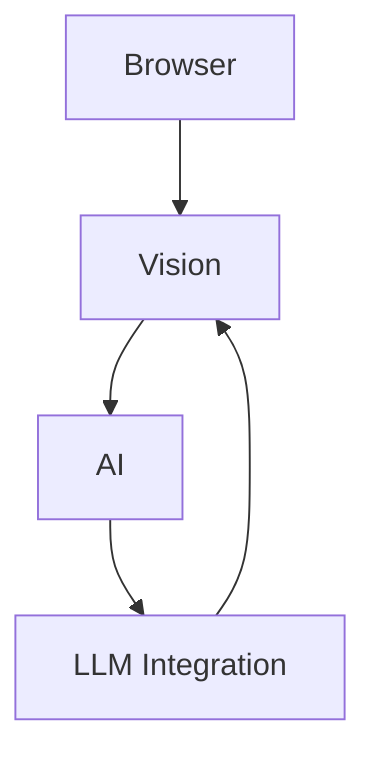
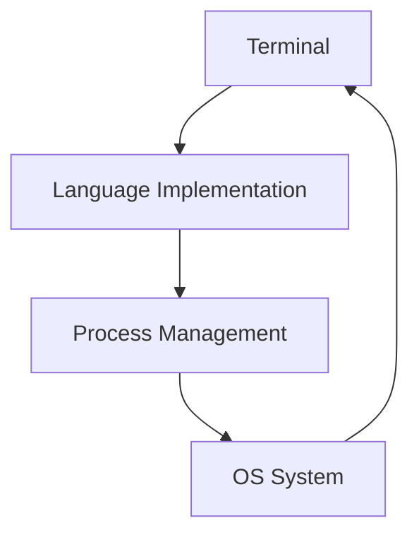
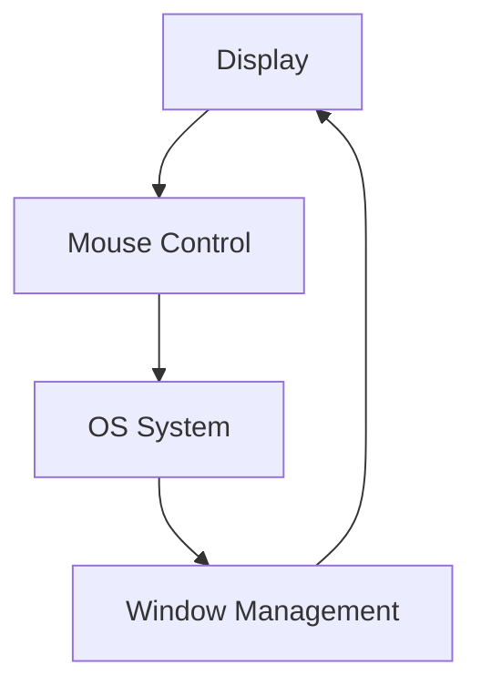

# Indirect Dependencies Analysis

## Overview
This document analyzes indirect dependencies between system components, identifying non-obvious relationships and potential circular dependencies that could impact system stability and maintainability.

## Core Component Chains

### 1. Browser → Vision → AI Chain

**Circular Dependency**: Vision ↔ AI
- Vision system uses AI for image analysis
- AI system uses Vision for image processing
- **Impact**: Could cause initialization issues
- **Mitigation**: Lazy loading and state management

### 2. Terminal → Language → Process Chain

**Circular Dependency**: Terminal ↔ OS
- Terminal needs OS for process management
- OS uses Terminal for command execution
- **Impact**: Could affect system initialization
- **Mitigation**: Clear separation of concerns

### 3. Display → Input → OS Chain

**Circular Dependency**: Display ↔ OS
- Display needs OS for window management
- OS needs Display for visual feedback
- **Impact**: Could affect UI responsiveness
- **Mitigation**: Event-based communication

## Hidden Dependencies

### 1. Resource Dependencies
```python
# Components sharing file system resources
Browser.download() -> Files.write()
Vision.process() -> Files.read()
Terminal.execute() -> Files.access()
```

### 2. State Dependencies
```python
# Components sharing state information
AI.context -> Terminal.history
Browser.session -> OS.environment
Display.configuration -> Vision.settings
```

### 3. Configuration Dependencies
```python
# Components sharing configuration
Terminal.settings -> OS.environment
Browser.config -> Files.permissions
Vision.params -> AI.settings
```

## Impact Analysis

### 1. Initialization Order
- **Critical Path**:
  1. OS System (base functionality)
  2. File System (resource access)
  3. Terminal System (command execution)
  4. Other Components

### 2. Resource Sharing
- **Shared Resources**:
  - File System
  - Process Management
  - Window Management
  - Clipboard

### 3. State Management
- **Shared State**:
  - Configuration Settings
  - User Preferences
  - System State
  - Session Information

## Risk Assessment

### 1. High-Risk Dependencies
- Vision ↔ AI circular dependency
- Terminal ↔ OS circular dependency
- Display ↔ OS circular dependency

### 2. Resource Contention
- File system access conflicts
- Process management overhead
- Memory management issues

### 3. State Synchronization
- Configuration inconsistencies
- State update propagation
- Cache invalidation

## Mitigation Strategies

### 1. Architectural Patterns
```python
# Dependency Injection
class Component:
    def __init__(self, dependencies):
        self.dependencies = dependencies
        
# Event-Based Communication
class EventBus:
    def publish(self, event):
        pass
    def subscribe(self, event_type, handler):
        pass
```

### 2. Resource Management
```python
# Resource Pool
class ResourcePool:
    def acquire(self, resource_id):
        pass
    def release(self, resource_id):
        pass
        
# State Manager
class StateManager:
    def update(self, component_id, state):
        pass
    def get_state(self, component_id):
        pass
```

### 3. Initialization Control
```python
# Component Lifecycle
class ComponentLifecycle:
    def initialize(self):
        pass
    def start(self):
        pass
    def stop(self):
        pass
```

## Improvement Recommendations

### 1. Short-term
- Implement dependency injection
- Add resource pooling
- Improve state management

### 2. Medium-term
- Refactor circular dependencies
- Enhance error handling
- Add monitoring

### 3. Long-term
- Implement microservices architecture
- Add service mesh
- Enhance scalability

## Next Steps

1. **Detailed Analysis**
   - Map all indirect dependencies
   - Document resource sharing
   - Analyze state flow

2. **Implementation**
   - Create dependency injection system
   - Implement resource pooling
   - Add state management

3. **Validation**
   - Test initialization order
   - Verify resource management
   - Check state consistency

## Related Documents
- analysis/integration_analysis.md
- analysis/component_dependencies.md
- analysis/future_considerations.md
