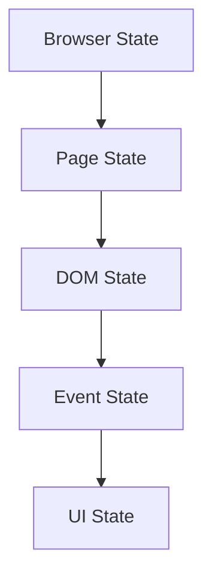
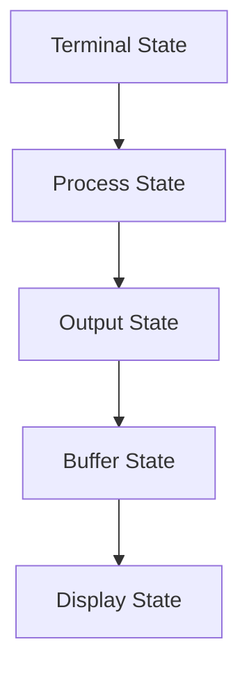
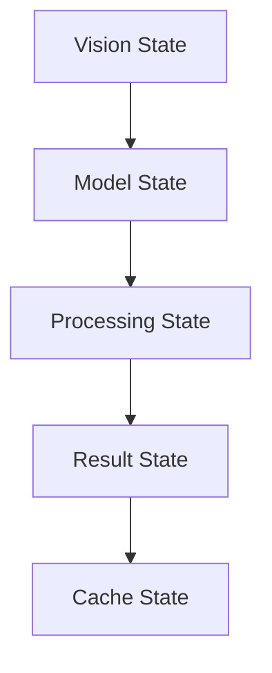

# State Management Analysis

## Overview
This document analyzes how system state is managed, synchronized, and maintained across components, identifying state flow patterns, potential conflicts, and optimization opportunities.

## State Types

### 1. Component State
```python
# Internal Component State
class ComponentState:
    def __init__(self):
        self._state = {}
        self._lock = threading.Lock()
        
    def update(self, key, value):
        with self._lock:
            self._state[key] = value
            self._notify_observers(key)
```

### 2. Shared State
```python
# Shared System State
class SharedState:
    def __init__(self):
        self._state = {}
        self._observers = {}
        
    def register_observer(self, key, observer):
        if key not in self._observers:
            self._observers[key] = []
        self._observers[key].append(observer)
```

### 3. Persistent State
```python
# Persistent Storage State
class PersistentState:
    def __init__(self, path):
        self.path = path
        self._state = self._load_state()
        
    def _load_state(self):
        if os.path.exists(self.path):
            with open(self.path, 'r') as f:
                return json.load(f)
        return {}
```

## State Flow Patterns

### 1. Browser State Flow


### 2. Terminal State Flow


### 3. Vision State Flow


## State Synchronization

### 1. Observer Pattern
```python
class StateObserver:
    def __init__(self):
        self.observers = []
        
    def add_observer(self, observer):
        self.observers.append(observer)
        
    def notify_observers(self, state):
        for observer in self.observers:
            observer.update(state)
```

### 2. Event System
```python
class EventSystem:
    def __init__(self):
        self.handlers = {}
        
    def subscribe(self, event_type, handler):
        if event_type not in self.handlers:
            self.handlers[event_type] = []
        self.handlers[event_type].append(handler)
        
    def publish(self, event_type, data):
        if event_type in self.handlers:
            for handler in self.handlers[event_type]:
                handler(data)
```

### 3. State Machine
```python
class StateMachine:
    def __init__(self):
        self.state = None
        self.transitions = {}
        
    def add_transition(self, from_state, to_state, condition):
        if from_state not in self.transitions:
            self.transitions[from_state] = []
        self.transitions[from_state].append((to_state, condition))
        
    def update(self):
        if self.state in self.transitions:
            for to_state, condition in self.transitions[self.state]:
                if condition():
                    self.state = to_state
                    break
```

## State Conflicts

### 1. Race Conditions
```python
# Race Condition Prevention
class SafeState:
    def __init__(self):
        self._state = {}
        self._lock = threading.Lock()
        
    def update(self, key, value):
        with self._lock:
            old_value = self._state.get(key)
            self._state[key] = value
            return old_value
```

### 2. Deadlocks
```python
# Deadlock Prevention
class DeadlockFreeState:
    def __init__(self):
        self._locks = {}
        self._lock_order = []
        
    def acquire_locks(self, required_locks):
        sorted_locks = sorted(required_locks, key=lambda x: self._lock_order.index(x))
        for lock in sorted_locks:
            self._locks[lock].acquire()
```

### 3. Inconsistencies
```python
# State Consistency
class ConsistentState:
    def __init__(self):
        self._state = {}
        self._version = 0
        
    def update(self, key, value, expected_version):
        if self._version != expected_version:
            raise InconsistentStateError()
        self._state[key] = value
        self._version += 1
```

## State Recovery

### 1. Checkpointing
```python
class StateCheckpoint:
    def __init__(self):
        self.checkpoints = []
        
    def create_checkpoint(self):
        checkpoint = copy.deepcopy(self._state)
        self.checkpoints.append(checkpoint)
        
    def restore_checkpoint(self, index):
        if index < len(self.checkpoints):
            self._state = copy.deepcopy(self.checkpoints[index])
```

### 2. Transaction Log
```python
class TransactionLog:
    def __init__(self):
        self.log = []
        
    def log_transaction(self, operation):
        self.log.append({
            'operation': operation,
            'timestamp': time.time(),
            'state': copy.deepcopy(self._state)
        })
```

### 3. Error Recovery
```python
class ErrorRecovery:
    def __init__(self):
        self.error_handlers = {}
        
    def register_handler(self, error_type, handler):
        self.error_handlers[error_type] = handler
        
    def handle_error(self, error):
        if type(error) in self.error_handlers:
            self.error_handlers[type(error)](error)
```

## Optimization Strategies

### 1. State Caching
```python
class StateCache:
    def __init__(self):
        self.cache = {}
        self.ttl = {}
        
    def get(self, key):
        if key in self.cache and time.time() < self.ttl[key]:
            return self.cache[key]
        value = self.load_state(key)
        self.cache[key] = value
        self.ttl[key] = time.time() + 300  # 5 minutes
        return value
```

### 2. Lazy Loading
```python
class LazyState:
    def __init__(self):
        self._loaded_states = {}
        
    def get_state(self, component):
        if component not in self._loaded_states:
            self._loaded_states[component] = self.load_state(component)
        return self._loaded_states[component]
```

### 3. State Compression
```python
class CompressedState:
    def __init__(self):
        self.compress_threshold = 1024  # 1KB
        
    def store_state(self, state):
        if len(str(state)) > self.compress_threshold:
            return zlib.compress(json.dumps(state).encode())
        return state
```

## Monitoring and Metrics

### 1. State Metrics
```python
class StateMetrics:
    def __init__(self):
        self.metrics = {
            'updates': 0,
            'conflicts': 0,
            'recoveries': 0
        }
        
    def track_operation(self, operation_type):
        self.metrics[operation_type] += 1
```

### 2. Performance Metrics
```python
class StatePerformance:
    def __init__(self):
        self.timings = {}
        
    def measure_operation(self, operation):
        start = time.time()
        yield
        duration = time.time() - start
        self.timings[operation] = duration
```

## Improvement Recommendations

### 1. Short-term
- Implement state validation
- Add conflict detection
- Improve error recovery

### 2. Medium-term
- Optimize state synchronization
- Enhance caching
- Add monitoring

### 3. Long-term
- Implement distributed state
- Add state replication
- Enhance resilience

## Next Steps

1. **Implementation**
   - Create state validators
   - Add monitoring
   - Implement caching

2. **Validation**
   - Test state flow
   - Verify synchronization
   - Check recovery

3. **Documentation**
   - Update patterns
   - Document metrics
   - Create guides

## Related Documents
- analysis/integration_analysis.md
- analysis/component_dependencies.md
- analysis/resource_management.md
