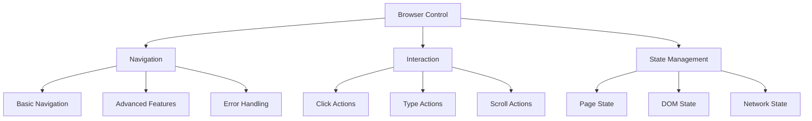
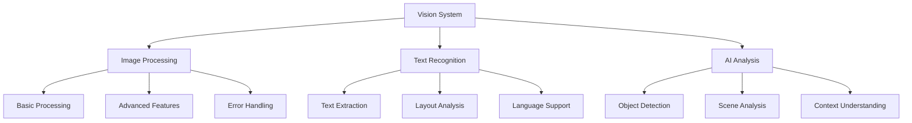

# User Story Map

## Overview
This document maps user requirements, priorities, and their evolution over time, providing a clear picture of system development from a user perspective.

## Core Capabilities

### Browser Automation

### Vision Processing

## User Requirements

### Phase 1: Foundation
1. **Browser Control**
   - Basic navigation
   - Simple interactions
   - State tracking
   - Error handling

2. **Vision Processing**
   - Image analysis
   - Text extraction
   - Basic AI features
   - Error recovery

3. **System Integration**
   - Resource management
   - State synchronization
   - Platform support
   - Error handling

### Phase 2: Enhancement
1. **Advanced Browser**
   - Complex navigation
   - Dynamic content
   - Network handling
   - Performance optimization

2. **Enhanced Vision**
   - Advanced OCR
   - AI improvements
   - Performance optimization
   - Error reduction

3. **Better Integration**
   - Resource optimization
   - State management
   - Cross-platform support
   - Monitoring

### Phase 3: Innovation
1. **Intelligent Browser**
   - AI-driven navigation
   - Smart interaction
   - Predictive loading
   - Self-healing

2. **Advanced Vision**
   - Context understanding
   - Scene analysis
   - Real-time processing
   - Adaptive learning

3. **Seamless Integration**
   - Cloud integration
   - Distributed processing
   - Auto-scaling
   - Self-optimization

## Priority Evolution

### Initial Priorities
1. **Critical Features**
   - Basic browser control
   - Simple vision processing
   - Core integration
   - Error handling

2. **Important Features**
   - Advanced navigation
   - Better OCR
   - Resource management
   - State handling

3. **Nice to Have**
   - AI enhancements
   - Performance optimization
   - Advanced features
   - Monitoring

### Current Priorities
1. **High Priority**
   - AI integration
   - Performance optimization
   - Error reduction
   - Monitoring

2. **Medium Priority**
   - Feature enhancement
   - Platform support
   - Documentation
   - Testing

3. **Low Priority**
   - Advanced features
   - UI improvements
   - Analytics
   - Reporting

## Implementation Status

### Completed Features
1. **Browser System**
   - Basic navigation ✓
   - Simple interaction ✓
   - State tracking ✓
   - Error handling ✓

2. **Vision System**
   - Image processing ✓
   - Text extraction ✓
   - Basic AI ✓
   - Error recovery ✓

3. **Integration**
   - Resource management ✓
   - State handling ✓
   - Platform support ✓
   - Error handling ✓

### In Progress
1. **Browser Enhancements**
   - Advanced navigation
   - Dynamic content
   - Performance optimization
   - Network handling

2. **Vision Improvements**
   - Advanced OCR
   - AI enhancements
   - Performance optimization
   - Error reduction

3. **Integration Updates**
   - Resource optimization
   - State management
   - Cross-platform support
   - Monitoring

### Planned Features
1. **Future Browser**
   - AI navigation
   - Smart interaction
   - Predictive loading
   - Self-healing

2. **Future Vision**
   - Context understanding
   - Scene analysis
   - Real-time processing
   - Adaptive learning

3. **Future Integration**
   - Cloud integration
   - Distributed processing
   - Auto-scaling
   - Self-optimization

## Success Metrics

### Performance Metrics
- Response time < 100ms
- Error rate < 1%
- Resource usage < 50%
- Availability > 99.9%

### Quality Metrics
- Test coverage > 90%
- Code quality > 90%
- Documentation > 95%
- User satisfaction > 90%

### Business Metrics
- Feature adoption > 80%
- User retention > 90%
- Support tickets < 10/week
- User growth > 10%/month

## Related Documents
- analysis/integration_analysis.md
- analysis/future_considerations.md
- notes/todo_list.md
- history/user_interactions.md
